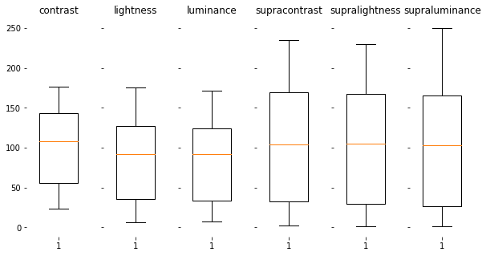
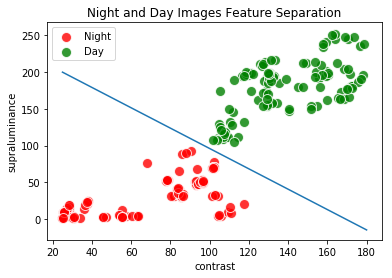
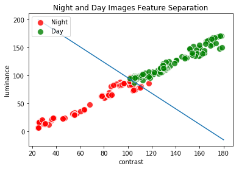
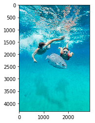
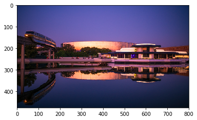

#########################################
DAY AND NIGHT IMAGE ANALYSIS & PREDICTION
#########################################

OVERVIEW
========

`Exploring Features <https://github.com/ayivima/day_night_image_analysis/blob/master/feature_engineering/feature_exploration.md/>`_

`Modelling and Prediction using estimations of Luminance, Contrast, Supra-Contrast, and Supra-Luminance. <https://github.com/ayivima/day_night_image_analysis/blob/master/model_notebook/modelling_and_prediction.md/>`_

`Modelling and Prediction using estimations of Contrast and Supra-Luminance. <https://github.com/ayivima/day_night_image_analysis/blob/master/model_notebook/modelling_and_prediction2.md/>`_

HIGHLIGHTS
==========

Box Plots for Feature Distribution of Training Images
^^^^^^^^^^^^^^^^^^^^^^^^^^^^^^^^^^^^^^^^^^^^^^^^^^^^^

Image Clusters and Separation based on features (Find out more about features `here <https://github.com/ayivima/day_night_image_analysis/blob/master/feature_engineering/feature_exploration.md/>`_)
^^^^^^^^^^^^^^^^^^^^^^^^^^^^^^^^^^^^^^^^^^^^^^^^^^^^^^^^^^^^^^^^^^^^^^^^^^^^^^^^^^^^^^^^^^^^^^^^^^^^^^^^^^^^^^^

Contrast and Supraluminance

Contrast and Luminance

Sample Predictions (Find out more about modelling and predictions `here <https://github.com/ayivima/day_night_image_analysis/blob/master/model_notebook/modelling_and_prediction.md/>`_)
^^^^^^^^^^^^^^^^^^^^^^^^^^^^^^^^^^^^^^^^^^^^^^^^^^^^^^^^^^^^^^^^^^^^^^^^^^^^^^^^^^^^^^^^^^^^^^^^^^^^^^^^^^^^^^^^

.. code-block:: python

   predict("images/test3.jpg")

MODEL PREDICTIONS:
Naive_Bayes->night, NearestCentroid->night, LogisticRegression->night, 
K NearestNeighbors->night, DecisionTree->night, SupportVectorMachine->night

.. image:: model_notebook/output_21_1.png

.. code-block:: python

   predict("images/test12.jpg")

MODEL PREDICTIONS:
Naive_Bayes->day, NearestCentroid->day, LogisticRegression->night, 
K NearestNeighbors->day, DecisionTree->day, SupportVectorMachine->day

.. code-block:: python

   predict("images/test10.jpg")

MODEL PREDICTIONS:
Naive_Bayes->night, NearestCentroid->night, LogisticRegression->night, 
K NearestNeighbors->night, DecisionTree->night, SupportVectorMachine->night

** This image qualifies for some sort of an adversarial example.

