# FEATURE ENGINEERING

Victor Mawusi Ayi


```python
import matplotlib.pyplot as plt

from data import Dataset
from features import (
    contrast,
    lightness,
    luminance,
    supracontrast,
    supralightness,
    supraluminance
)
from visualize import fsep

```


```python
image_dir_training = "day_night_images/training/"
image_dir_test = "day_night_images/test/"

traindata = Dataset(image_dir_training)
testdata = Dataset(image_dir_test)

traindf, trainlabels = traindata.featureset()
testdf, testlabels = testdata.featureset()

traindf2 = traindf.copy()
traindf2["labels"]=trainlabels
```

# Data Understanding

### Descriptive Statistics

###### Training Data


```python
traindf.describe()
```


<div>
<table border="1" class="dataframe">
  <thead>
    <tr style="text-align: right;">
      <th></th>
      <th>contrast</th>
      <th>lightness</th>
      <th>luminance</th>
      <th>supracontrast</th>
      <th>supralightness</th>
      <th>supraluminance</th>
    </tr>
  </thead>
  <tbody>
    <tr>
      <th>count</th>
      <td>240.000000</td>
      <td>240.000000</td>
      <td>240.000000</td>
      <td>240.000000</td>
      <td>240.000000</td>
      <td>240.000000</td>
    </tr>
    <tr>
      <th>mean</th>
      <td>104.885568</td>
      <td>89.381018</td>
      <td>89.911785</td>
      <td>109.306591</td>
      <td>104.883497</td>
      <td>105.819555</td>
    </tr>
    <tr>
      <th>std</th>
      <td>42.227565</td>
      <td>44.232745</td>
      <td>43.622508</td>
      <td>75.217800</td>
      <td>75.117823</td>
      <td>80.194307</td>
    </tr>
    <tr>
      <th>min</th>
      <td>24.984343</td>
      <td>6.782308</td>
      <td>6.959812</td>
      <td>2.641581</td>
      <td>1.521024</td>
      <td>0.807192</td>
    </tr>
    <tr>
      <th>25%</th>
      <td>83.760365</td>
      <td>64.125433</td>
      <td>63.939867</td>
      <td>36.760082</td>
      <td>37.625771</td>
      <td>31.232245</td>
    </tr>
    <tr>
      <th>50%</th>
      <td>105.136970</td>
      <td>91.473546</td>
      <td>90.727541</td>
      <td>103.188162</td>
      <td>95.597614</td>
      <td>98.620032</td>
    </tr>
    <tr>
      <th>75%</th>
      <td>131.002402</td>
      <td>117.226463</td>
      <td>113.640314</td>
      <td>184.149526</td>
      <td>178.384524</td>
      <td>188.842549</td>
    </tr>
    <tr>
      <th>max</th>
      <td>178.577429</td>
      <td>174.035764</td>
      <td>171.360772</td>
      <td>240.868393</td>
      <td>238.091096</td>
      <td>252.067432</td>
    </tr>
  </tbody>
</table>
</div>


###### Testing Data


```python
testdf.describe()
```


<div>
<table border="1" class="dataframe">
  <thead>
    <tr style="text-align: right;">
      <th></th>
      <th>contrast</th>
      <th>lightness</th>
      <th>luminance</th>
      <th>supracontrast</th>
      <th>supralightness</th>
      <th>supraluminance</th>
    </tr>
  </thead>
  <tbody>
    <tr>
      <th>count</th>
      <td>161.000000</td>
      <td>161.000000</td>
      <td>161.000000</td>
      <td>161.000000</td>
      <td>161.000000</td>
      <td>161.000000</td>
    </tr>
    <tr>
      <th>mean</th>
      <td>104.012253</td>
      <td>88.759438</td>
      <td>89.613619</td>
      <td>104.263534</td>
      <td>98.320784</td>
      <td>98.943657</td>
    </tr>
    <tr>
      <th>std</th>
      <td>46.518889</td>
      <td>48.130675</td>
      <td>48.439403</td>
      <td>72.504832</td>
      <td>72.974899</td>
      <td>77.210730</td>
    </tr>
    <tr>
      <th>min</th>
      <td>24.056388</td>
      <td>6.780612</td>
      <td>7.081857</td>
      <td>2.591807</td>
      <td>1.450084</td>
      <td>1.058279</td>
    </tr>
    <tr>
      <th>25%</th>
      <td>55.679681</td>
      <td>35.844996</td>
      <td>33.311002</td>
      <td>33.141427</td>
      <td>29.374687</td>
      <td>26.194734</td>
    </tr>
    <tr>
      <th>50%</th>
      <td>108.224052</td>
      <td>91.563604</td>
      <td>91.603365</td>
      <td>104.595355</td>
      <td>105.590096</td>
      <td>103.053452</td>
    </tr>
    <tr>
      <th>75%</th>
      <td>143.752952</td>
      <td>127.325436</td>
      <td>124.489932</td>
      <td>169.750936</td>
      <td>168.026807</td>
      <td>165.128472</td>
    </tr>
    <tr>
      <th>max</th>
      <td>176.355730</td>
      <td>175.247572</td>
      <td>171.087171</td>
      <td>235.146434</td>
      <td>230.161313</td>
      <td>249.686709</td>
    </tr>
  </tbody>
</table>
</div>


###### Descriptive Statistics with Boxplots


```python

f, ax = plt.subplots(1, 6, sharey=True, sharex=True)
f.set_figwidth(10)
f.set_figheight(5)

feats = [
    "contrast",
    "lightness",
    "luminance",
    "supracontrast",
    "supralightness",
    "supraluminance"
]

for ax_, feat in zip(ax, feats):
    ax_.boxplot(testdf[feat], widths=0.6)
    ax_.set_title(feat)
    ax_.spines['top'].set_visible(False)
    ax_.spines['right'].set_visible(False)
    ax_.spines['bottom'].set_visible(False)
    ax_.spines['left'].set_visible(False)


```


Supraluminance has the widest range of values, followed by supracontrast and supralightness. Their means are 98.943657, 104.263534,	98.320784 respectively and could be used as a threshold for separating day and night images.

For separating features, the features extracted from the superior portions of images may be better than their general counterparts. 

# Clustering Images by Features

Visualizing day and night image clusters in 2D space defined by selected features.

Features:
- Contrast - Standard deviation of image intensities after transformation to grayscale.
- Luminance - Relative luminance calculated on the average of intensities for each RGB channel
- Lightness - Average value for the lightness channel of images transformed into HSL color space
- Supra-Contrast - Contrast calculated for superior portion of an image
- Supra-Lightness - Lightness calculated for superior portion of an image
- Supra-Luminance - Luminance calculated for superior portion of an image

### Contrast vrs Luminance


```python
sep_coords=([25, 180], [200, -15])
fsep(traindf2, ["contrast", "luminance"], sep_coords)
```


### Contrast vrs Lightness


```python
sep_coords=([25, 180], [200, -15])
fsep(traindf2, ["contrast", "lightness"], sep_coords)
```


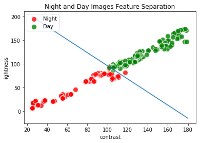


### Luminance vrs Lightness

Luminance and lightness are highly correlated and only one of them is needed for training and prediction.


```python
sep_coords=([25, 180], [170, -15])
fsep(traindf2, ["luminance", "lightness"], sep_coords)
```


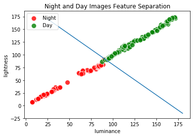


### Contrast vrs Supra-Luminance


```python
sep_coords=([25, 180], [200, -15])
fsep(traindf2, ["contrast", "supraluminance"], sep_coords)
```


### Lightness vrs Supra-Luminance


```python
sep_coords=([0, 180], [210, -15])
fsep(traindf2, ["lightness", "supraluminance"], sep_coords)
```


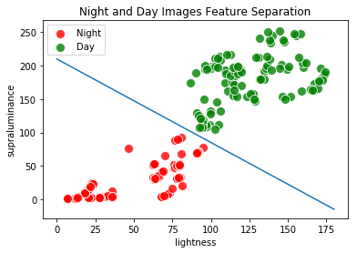


### Luminance vrs Supra-Luminance


```python
sep_coords=([0, 180], [210, -15])
fsep(traindf2, ["luminance", "supraluminance"], sep_coords)
```


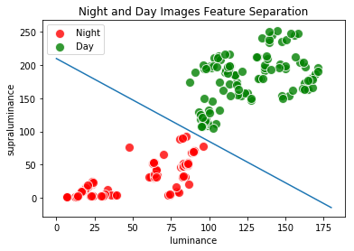


### Contrast vrs Supra-Contrast


```python
sep_coords=([0, 180], [260, -15])
fsep(traindf2, ["contrast", "supracontrast"], sep_coords)
```


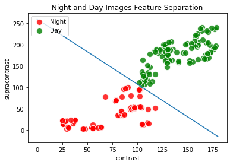


### Lightness vrs Supra-Contrast


```python
sep_coords=([0, 180], [220, -15])
fsep(traindf2, ["lightness", "supracontrast"], sep_coords)
```


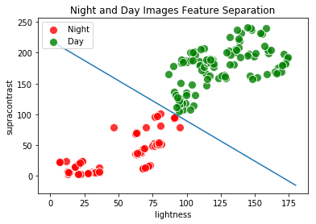


### Luminance vrs Supra-Contrast


```python
sep_coords=([0, 180], [220, -15])
fsep(traindf2, ["luminance", "supracontrast"], sep_coords)
```


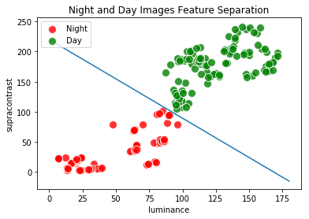


### Contrast vrs Supra-Lightness


```python
sep_coords=([0, 180], [240, -15])
fsep(traindf2, ["contrast", "supralightness"], sep_coords)
```


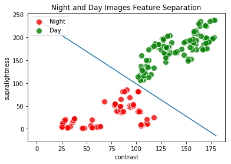


### Lightness vrs Supra-Lightness


```python
sep_coords=([0, 180], [215, -15])
fsep(traindf2, ["lightness", "supralightness"], sep_coords)
```


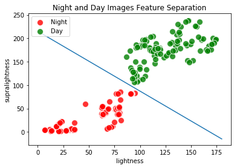


### Luminance vrs Supra-Lightness


```python
sep_coords=([0, 180], [215, -15])
fsep(traindf2, ["luminance", "supralightness"], sep_coords)
```


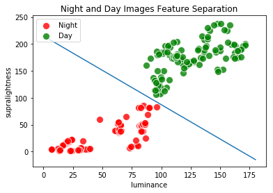


### Supra-Luminance vrs Supra-Lightness


```python
sep_coords=([0, 180], [240, -15])
fsep(traindf2, ["supraluminance", "supralightness"], sep_coords)
```


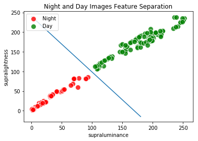


### Supra-Luminance vrs Supra-Contrast


```python
sep_coords=([0, 180], [250, -15])
fsep(traindf2, ["supraluminance", "supracontrast"], sep_coords)
```


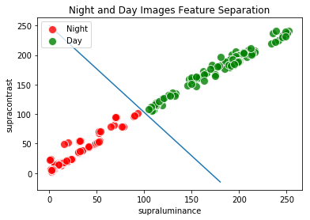


### Supra-Lightness vrs Supra-Contrast 


```python
sep_coords=([0, 180], [240, -15])
fsep(traindf2, ["supralightness", "supracontrast"], sep_coords)
```


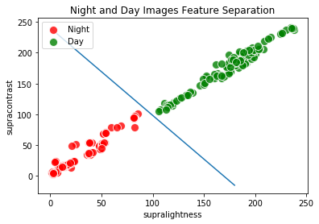


```python

```
