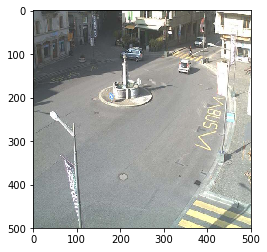
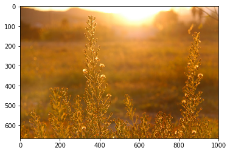
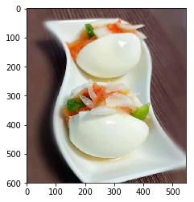
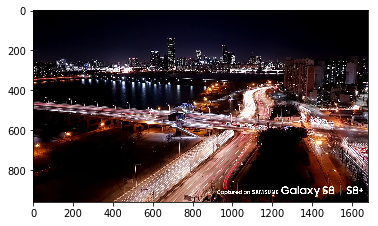
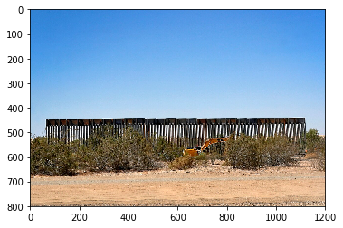
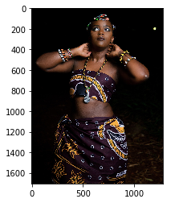
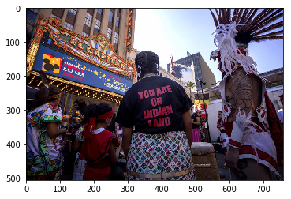

# MODELLING AND PREDICTION USING CONTRAST, AND SUPERIOR LUMINANCE.

Victor Mawusi Ayi


```python
import matplotlib.pyplot as plt
import matplotlib.image as mpimg
from sklearn.linear_model import LogisticRegression
from sklearn.naive_bayes import GaussianNB
from sklearn.neighbors import KNeighborsClassifier
from sklearn.neighbors.nearest_centroid import NearestCentroid
from sklearn.svm import SVC
from sklearn.tree import DecisionTreeClassifier

from data import Dataset
from features import (
    contrast,
    lightness,
    luminance,
    supracontrast,
    supralightness,
    supraluminance
)
from modelling import Model
from visualize import fsep

```


```python
image_dir_training = "day_night_images/training/"
image_dir_test = "day_night_images/test/"
image_size = (500, 500)

traindata = Dataset(image_dir_training, image_size=image_size)
testdata = Dataset(image_dir_test, image_size=image_size)

trainfs = traindata.featureset()
testfs = testdata.featureset()
```

# Models

#### Feature Selection

Feature visualizations demonstrated a clean separation between day and night observations for the plot of contrast against supraluminance. That is good justification for modelling on just these two features. Notwithstanding, caution must be exercised in such circumstances, as the risk of overfitting may share an inverse relation with the number of features, within the limits where the curse of dimensionality is not yet a threat.


```python
features = [
    "contrast",
    "supraluminance",
]
classes = traindata.classes
```

#### Setting up the custom modelling function

```python

def modeller(classifier):
    model = Model(
        classifier,
        classes,
        image_size,
        features
    )

    model.train(trainfs)
    testreport = model.test(testfs)
    print(testreport[0])
    print("Indexes of wrongly classified images:", testreport[1])
    
    return model

def showmisfit(imgindex, model):
    misfit = testdata.data[imgindex]
    print(model.predict(misfit))
    plt.imshow(misfit)

```

# Using Nearest Centroid


```python
ncent = modeller(NearestCentroid())
```

    Overall Accuracy -> 99.38%
    
    Class Accuracies:
    Class 0: 80/80 --> 100.0%
    Class 1: 80/81 --> 98.77%
    Indexes of wrongly classified images: (114,)


```python
showmisfit(114, ncent)
```

    night


# Using Logistic Regression


```python
logreg = modeller(LogisticRegression())
```

    Overall Accuracy -> 96.27%
    
    Class Accuracies:
    Class 0: 78/80 --> 97.5%
    Class 1: 77/81 --> 95.06%
    Indexes of wrongly classified images: (9, 54, 123, 129, 143, 150)


```python
showmisfit(123, logreg)
```

    night





# Using K Nearest Neighbor


```python
knn = modeller(KNeighborsClassifier())
```

    Overall Accuracy -> 100.0%
    
    Class Accuracies:
    Class 0: 80/80 --> 100.0%
    Class 1: 81/81 --> 100.0%
    Indexes of wrongly classified images: ()


# Using Naive_Bayes


```python
gnb = modeller(GaussianNB())
```

    Overall Accuracy -> 98.76%
    
    Class Accuracies:
    Class 0: 78/80 --> 97.5%
    Class 1: 81/81 --> 100.0%
    Indexes of wrongly classified images: (25, 53)


```python
showmisfit(25, gnb)
```

    day


# Using Decision Tree


```python
dtc = modeller(DecisionTreeClassifier())
```

    Overall Accuracy -> 100.0%
    
    Class Accuracies:
    Class 0: 80/80 --> 100.0%
    Class 1: 81/81 --> 100.0%
    Indexes of wrongly classified images: ()


```python

```

# Using Support Vector Machines


```python
svc = modeller(SVC(kernel="linear"))
```

    Overall Accuracy -> 98.76%
    
    Class Accuracies:
    Class 0: 78/80 --> 97.5%
    Class 1: 81/81 --> 100.0%
    Indexes of wrongly classified images: (25, 53)


```python
showmisfit(25, svc)
```

    day


# PREDICTING FOR RANDOM IMAGES


```python
def modeltest(imagepath):    
    rgbimg = mpimg.imread(imagepath)
    classifierlist = (
        "Naive_Bayes->{}, NearestCentroid->{}, LogisticRegression->{},"
        " \nK NearestNeighbors->{}, DecisionTree->{}, SupportVectorMachine->{}"
        
    )
    
    print(classifierlist.format(
        gnb.predict(rgbimg),
        ncent.predict(rgbimg),
        logreg.predict(rgbimg),
        knn.predict(rgbimg),
        dtc.predict(rgbimg),
        svc.predict(rgbimg)
    ))

    plt.imshow(rgbimg)
```


```python
modeltest("images/test1.jpg")
```

    Naive_Bayes->day, NearestCentroid->day, LogisticRegression->night, 
    K NearestNeighbors->day, DecisionTree->day, SupportVectorMachine->day





```python
modeltest("images/test2.jpg")
```

    Naive_Bayes->night, NearestCentroid->night, LogisticRegression->night, 
    K NearestNeighbors->night, DecisionTree->night, SupportVectorMachine->night





```python
modeltest("images/test3.jpg")
```

    Naive_Bayes->night, NearestCentroid->night, LogisticRegression->night, 
    K NearestNeighbors->night, DecisionTree->night, SupportVectorMachine->night





```python
modeltest("images/test4.jpg")
```

    Naive_Bayes->day, NearestCentroid->day, LogisticRegression->day, 
    K NearestNeighbors->day, DecisionTree->day, SupportVectorMachine->day





```python
modeltest("images/test5.jpg")
```

    Naive_Bayes->night, NearestCentroid->night, LogisticRegression->night, 
    K NearestNeighbors->night, DecisionTree->night, SupportVectorMachine->night





```python
modeltest("images/test6.jpg")
```

    Naive_Bayes->night, NearestCentroid->night, LogisticRegression->night, 
    K NearestNeighbors->night, DecisionTree->night, SupportVectorMachine->night


```python
modeltest("images/test7.jpg")
```

    Naive_Bayes->day, NearestCentroid->day, LogisticRegression->day, 
    K NearestNeighbors->day, DecisionTree->day, SupportVectorMachine->day





```python
modeltest("images/test8.jpg")
```

    Naive_Bayes->day, NearestCentroid->day, LogisticRegression->day, 
    K NearestNeighbors->day, DecisionTree->day, SupportVectorMachine->day


```python
modeltest("images/test9.jpg")
```

    Naive_Bayes->day, NearestCentroid->day, LogisticRegression->night, 
    K NearestNeighbors->day, DecisionTree->day, SupportVectorMachine->day


```python
modeltest("images/test10.jpg")
```

    Naive_Bayes->night, NearestCentroid->night, LogisticRegression->day, 
    K NearestNeighbors->night, DecisionTree->night, SupportVectorMachine->night


```python
modeltest("images/test11.jpg")
```

    Naive_Bayes->day, NearestCentroid->day, LogisticRegression->day, 
    K NearestNeighbors->day, DecisionTree->day, SupportVectorMachine->day


```python
modeltest("images/test12.jpg")
```

    Naive_Bayes->day, NearestCentroid->day, LogisticRegression->night, 
    K NearestNeighbors->day, DecisionTree->day, SupportVectorMachine->day


```python
modeltest("images/test13.jpg")
```

    Naive_Bayes->day, NearestCentroid->day, LogisticRegression->day, 
    K NearestNeighbors->day, DecisionTree->day, SupportVectorMachine->day


```python

```
